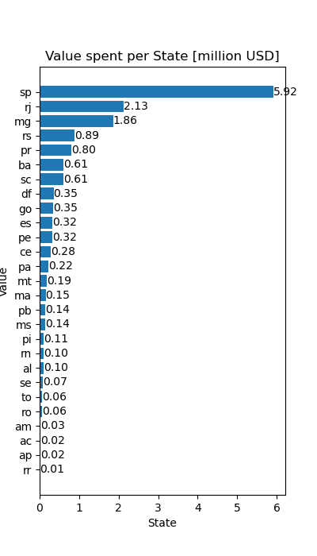
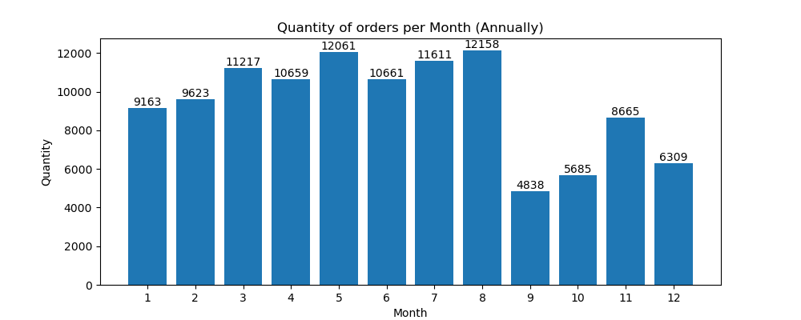
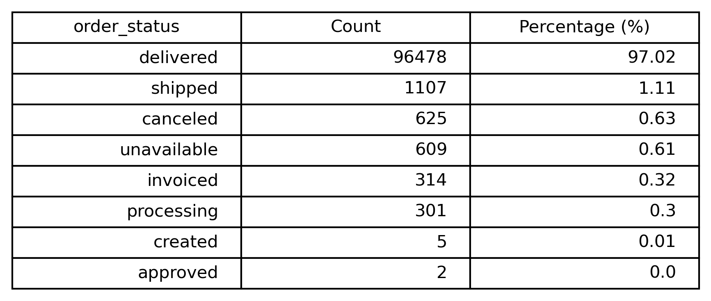
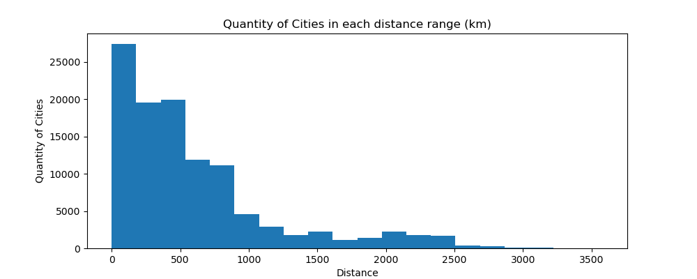
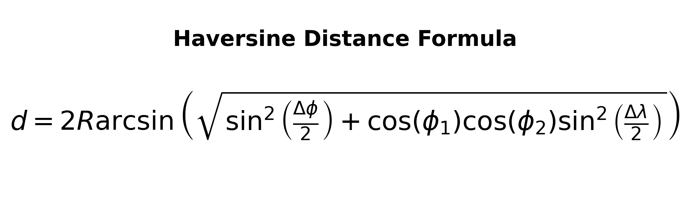
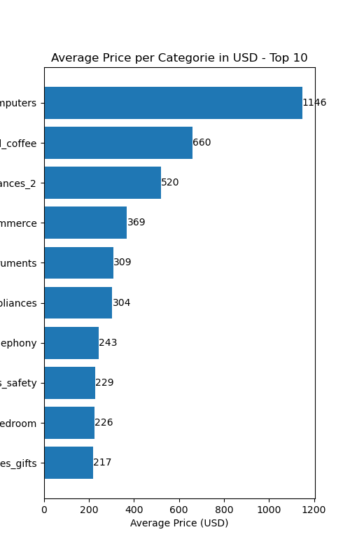
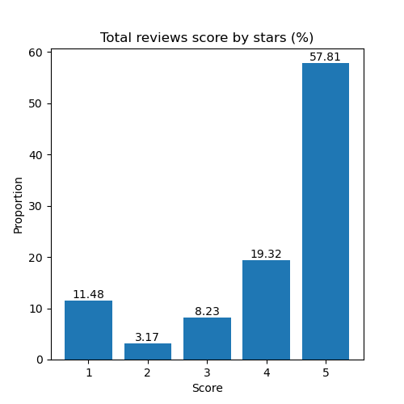

# Data Analysis Project

**Objective:** This project aims to consolidate the knowledge acquired during a Pandas course, where I learned fundamental data cleaning and preprocessing techniques. The goal was to work with a new dataset without any instructions or step-by-step guidance, allowing me to practice handling real-world data independently.

I chose a Brazilian e-commerce dataset containing information about orders, customers, sellers, reviews, prices, and other related data. The objective was to clean and prepare the datasets, identify data quality issues, and solve them appropriately. In addition, I performed exploratory data analysis to uncover relevant insights and better understand the data.

This repository contains the complete project, including a Jupyter Notebook with the full implementation. The notebook presents the complete workflow, while this file (step-by-description) has detailed explanations of each step, assumptions, and findings, and the README file provides a concise summary of the project and its main results.

## 1. Initial Treatment

After exploring the datasets, examining their columns, shapes, and how they were likely related to each other, I started by applying some basic data cleaning procedures.

### 1.1. NULL Values

During the initial exploration, I found three datasets containing missing values, and I applied a different strategy to each one:

- **df_order_reviews:** The missing values were only in the review title and review comment columns. For this project, this was not an issue because the most important information, the review score (star rating), was complete for all records. Therefore, I replaced the missing text fields with "no_comment" to make the missing information explicit.

- **df_products:** This dataset presented two different types of missing values:
    - First case: Missing descriptive information (such as text attributes). Since the information was unavailable, I filled these values with "no_information" to explicitly indicate that the data was missing.
    - Seconde case: Missing numerical attributes (such as product dimensions and weight). In this case, I replaced the missing values with the mean value of the corresponding product category. Since there were only a few missing records, using the category mean was a reasonable imputation strategy.

- **df_orders:** The missing values were found in date-related columns. However, these missing values were expected because those columns depend on the order status. For example, the delivery date is only available after an order has been delivered. Therefore, orders that were canceled or had not yet been completed naturally contained missing values in these fields. For this reason, I decided to keep these missing values unchanged.

### 1.2. Duplicated Values

After handling the missing values, I analyzed the datasets for duplicate records. My first step was to identify which columns should contain unique values in each dataset. To do this, I compared the number of unique IDs with the total number of rows in each DataFrame and investigated any discrepancies. Based on this analysis, I applied different strategies for each dataset:

- **df_order_payments:** This dataset contains multiple payment_sequential records for the same order_id, representing payments made in more than one installment. By summing the payment values for each order, it is possible to obtain the total amount paid. Therefore, I aggregated the payment information and transformed the dataset into a single row per order.

- **df_order_reviews:** This dataset contains cases where an order has multiple reviews and where the same review is associated with multiple orders. To obtain a one-to-one relationship between orders and reviews, I kept only one review per order, selecting the one with the lowest review score, and removed the remaining duplicate records.

- **df_geolocation:** This dataset is stored at the ZIP code level, with latitude and longitude for each ZIP code. Although this is not incorrect, my analysis required data at the city/state level. Therefore, I aggregated the coordinates by city and state to obtain a single representative location for each city. The details of this transformation are described in the next section.

- **df_order_items:** In this dataset, each product within an order is stored as a separate row. While this structure is appropriate for transactional data, my analysis required one row per order. Therefore, I aggregated the product information to calculate summary metrics such as the total order value. The details of this transformation are described in the next section.

For the remaining datasets, the duplicated IDs were consistent with their expected granularity and data structure, so no additional treatment was necessary.

### 1.3. Dataset Transformations

Some datasets did not contain errors, but their structure was not appropriate for the analyses I wanted to perform. Therefore, I applied aggregation and transformation techniques to obtain the required level of detail.

- **df_order_items:** To obtain a single summary record for each order, I grouped the dataset by order_id and created three aggregated features:
    - **total_items:** Total number of products in the order (row count).
    - **order_total_price:** Sum of the prices of all products in the order.
    - **freight_total_price:** Sum of the freight cost of all products in the order.
    
    -> Output dataset: `df_group_orders`.

- **df_geolocation:** This dataset required several transformations to reduce its granularity to the city level, correct inconsistent values, and standardize city names.

    - *City and state normalization:* I used the unicodedata library to remove accents and convert all city and state names to lowercase, ensuring consistent naming across datasets.

    - *Coordinate validation:* I identified invalid latitude and longitude values by comparing them with the official geographical limits of Brazil, obtained from publicly available sources:
        - `latitute:` -33.751° to +5.272°.
        - `longitude:` -73.991° to -33.751°.
    
    Any coordinates outside these ranges were considered invalid and removed.

    - *City-level aggregation:* Finally, I grouped the data by the combination of state and city (to distinguish cities with the same name in different states) and calculated:
        - **lat_mean:** Mean latitude of all ZIP codes within the city.
        - **lng_mean:** Mean longitude of all ZIP codes within the city.
    
    -> Output dataset: `df_city`.

Using the `df_city` dataset, I created two additional datasets containing geographical information:

- **df_customer_geo:** Associates each customer with the mean latitude and longitude of their city by matching the customer's city and state with `df_city`.

- **df_seller_geo:** Associates each seller with the mean latitude and longitude of their city using the same approach.

## 2. Data Analysis

With the datasets cleaned, transformed, and prepared, I started the exploratory data analysis to better understand purchasing behavior, order characteristics, and geographical patterns.

### 2.1. Financial Metrics

The first step was to analyze the financial aspects of the orders, such as total spending and its distribution across different dimensions. To do this, I merged the required datasets and created a series of visualizations.

#### 2.1.1. Value Spent per State

  

This chart shows the total amount spent on purchases in each Brazilian state (in millions of USD). We can observe that the state of São Paulo (SP) accounts for more than one-third of the total spending among the 27 Brazilian states, highlighting its economic importance within the dataset.

#### 2.1.2. Number of Orders per Month

  

The number of purchases varies considerably throughout the year. Order volume gradually increases from January and reaches its peak in August. After that, there is a sharp decline, with approximately one-third fewer orders in September compared to August. This behavior may indicate seasonality in the dataset or simply reflect the available period covered by the data.

### 2.2. Orders Metrics

The next step was to analyze categorical and operational characteristics of the orders beyond their monetary values.

#### 2.2.1. Order Status

  

Most orders in the dataset were successfully completed and delivered to customers. Only a small proportion of orders were canceled, unavailable, or remained in intermediate processing stages.

#### 2.2.2. Distance Between Customers and Sellers

  

For each order, I calculated the geographical distance between the customer and the seller using their city coordinates. The distance was computed with the Haversine formula:

  

    d = the distance between coordinates [km~]
    R = radius of Earth [km]
    ϕ1 = latitude of Customer [rad]
    ϕ2 = latitude of Seller [rad]
    Δϕ = ϕ2 - ϕ1
    Δλ = λ2 - λ1 (diference between longitude in radians) 

The distribution shows that most orders occur over relatively short distances, which is expected since shorter distances generally result in lower shipping costs and faster deliveries. The long right tail of the distribution also reflects Brazil's large geographical size, where some orders are shipped over very long distances.

#### 2.2.3. Average Product Price by Category

  

This chart presents the ten product categories with the highest average prices. As expected, the computers category ranks first and has an average price nearly twice that of the second most expensive category.

#### 2.2.4. Review Scores

  

This chart shows the distribution of review scores assigned to orders. Customer satisfaction appears to be high: considering ratings of 4 or 5 stars as positive reviews, approximately 77% of all orders received a positive evaluation.

## 3. Machine Learning

In this section, I briefly explored a machine learning application using the prepared dataset. The goal was not to build a highly optimized model, but rather to practice the basic steps of a supervised learning workflow, including data preparation, feature engineering, model training, and evaluation.

### 3.1. Machine Learning Dataset

To build the model, I created a final dataset by combining the previously generated datasets and selecting the features that I considered most relevant for predicting customer satisfaction. The final dataset contains the following columns:

- **order_id:** Order identifier (used only for reference).
- **delivered_time_second:** Time elapsed between order creation and delivery.
- **distance_km:** Distance between the customer and the seller.
- **total_items:** Total number of items in the order.
- **order_total_price:** Total value of the order.
- **freight_total_price:** Total shipping cost.
- **payment_type:** Payment method used.
- **payment_installments:** Number of payment installments.
- **review_score:** Customer review score (target variable).

Since the target variable was `review_score`, I filtered the dataset to include only delivered orders. This decision was appropriate because approximately 97% of the orders had already been delivered, and only delivered orders can receive customer reviews.

### 3.2. Feature Preprocessing

Before training the model, I applied preprocessing techniques according to the type of each feature.

#### 3.2.1. One-Hot Enconding

Categorical features must be converted into numerical representations before they can be used by most machine learning algorithms. For this purpose, I applied One-Hot Encoding, which creates one binary column for each category.

In this dataset, the only categorical feature was `payment_type`, which contains four possible payment methods, making the encoding process straightforward.

#### 3.2.1. Feature Normalization

For the numerical features, I applied StandardScaler, which standardizes each variable by subtracting its mean and dividing by its standard deviation. As a result, each feature has a mean of approximately 0 and a standard deviation of 1, allowing variables with different scales to contribute more equally during model training.

### 3.3. Train-Test Split

After preprocessing the features, I split the dataset into training and testing sets, reserving 20% of the observations for model evaluation. This separation helps estimate how well the model generalizes to unseen data.

### 3.4. Results

As a simple baseline, I evaluated the model using the R² (coefficient of determination) metric.

The model achieved the following results:

- **R² Train:** 0.1265
- **R² Test:** 0.1437

These scores indicate that the model explains only a small portion of the variance in the review scores. This outcome was expected, as the model was intentionally simple and used only a limited set of features without extensive feature engineering or hyperparameter optimization. Nevertheless, the exercise was valuable for practicing the complete machine learning workflow.

## 4. The Datasets

This section provides an overview of all the datasets used throughout the project, including their columns and a brief description of each feature.

##### **1. df_customer**

| column                               | description                                                             |
|--------------------------------------|-------------------------------------------------------------------------|
| `customer_id`                        | key to the order dataset; each order has a unique customer_id           |
| `customer_unique_id`                 | unique identifier of the customer                                       |
| `customer_zip_code_prefix`           | first five digits of the ZIP code (without leading zeros)               |
| `customer_city`                      | customer city name                                                      |
| `customer_state`                     | customer state (UF/FS)                                                  |

##### **2. df_geolocation**

| column                               | description                                                             |
|--------------------------------------|-------------------------------------------------------------------------|
| `geolocation_zip_code_prefix`        | first five digits of the ZIP code (without leading zeros)               |
| `geolocation_lat`                    | latitude coordinates                                                    |
| `geolocation_lng`                    | longitude coordinates                                                   |
| `geolocation_city`                   | city name                                                               |
| `geolocation_state`                  | federative state                                                        |

##### **3. df_order_items**

| column                               | description                                                             |
|--------------------------------------|-------------------------------------------------------------------------|
| `order_id`                           | order unique id                                                         |
| `order_item_id`                      | sequential number identyfing number of items included in the same order |
| `product_id`                         | product unique idetifier                                                |
| `seller_id`                          | seller unique identifier                                                |
| `shipping_limit_date`                | seller shipping limit date to handling the order to logistic partner    |
| `price`                              | item price (for each product)                                           |
| `freight_value`                      | freight value (for each product)                                        |

##### **4. df_order_payments**

| column                               | description                                                             |
|--------------------------------------|-------------------------------------------------------------------------|
| `order_id`                           | order unique id                                                         |
| `payment_sequential`                 | if the customer pay order with more than one method  it'll show here    |
| `payment_type`                       | method of payment chosen by the customer                                |
| `payment_installments`               | number of installments chosen by the customer                           |
| `payment_value`                      | transaction value                                                       |

##### **5. df_order_reviews**

| column                               | description                                                             |
|--------------------------------------|-------------------------------------------------------------------------|
| `review_id`                          | review unique id                                                        |
| `order_id`                           | order unique id                                                         |
| `review_score`                       | note of the satisfaction survey                                         |
| `review_comment_title`               | comment title from the review (Portuguese)                              |
| `review_comment_message`             | comment message from the review (Portuguese)                            |
| `review_creation_date`               | date when satisfaction survey was sent to the customer                  |
| `review_answer_timestamp`            | date when satisfation suvery was answered                               |

##### **6. df_orders**

| column                               | description                                                             |
|--------------------------------------|-------------------------------------------------------------------------|
| `order_id`                           | order unique id                                                         |
| `customer_id`                        | customer unique id                                                      |
| `order_status`                       | order status                                                            |
| `order_purchase_timestamp`           | purchase timestamp                                                      |
| `order_approved_at`                  | payment approval timestamp                                              |
| `order_delivered_carrier_date`       | order posting timestamp (handled to the logist partner)                 |
| `order_delivered_customer_date`      | order delivered to the customer                                         |
| `order_estimated_delivery_date`      | the estimated delivery date showed to the customer                      |

##### **7. df_products**

| column                               | description                                                             |
|--------------------------------------|-------------------------------------------------------------------------|
| `product_id`                         | product unique identifier                                               |
| `product_category_name`              | root category of product (Portuguese)                                   |
| `product_name_lenght`                | number of characters from the product name                              |
| `product_description_lenght`         | number of characters from the description                               |
| `product_photos_qty`                 | number of product published photos                                      |
| `product_weight_g`                   | product weight measured in grams                                        |
| `product_length_cm`                  | product lenght measured in centimeters                                  |
| `product_height_cm`                  | product height measured in centimeters                                  |
| `product_width_cm`                   | product width measured in centimeters                                   |

##### **8. df_sellers**

| column                               | description                                                             |
|--------------------------------------|-------------------------------------------------------------------------|
| `seller_id`                          | seller unique identifier                                                |
| `seller_zip_code_prefix`             | first five digits of the seller ZIP code (without leading zeros)        |
| `seller_city`                        | seller city                                                             |
| `seller_state`                       | seller state (UF/FS)                                                    |

##### **9. df_product_translation**

| column                               | description                                                             |
|--------------------------------------|-------------------------------------------------------------------------|
| `product_category_name`              | category name in Portuguese                                             |
| `product_category_name_english`      | category name in English                                                |